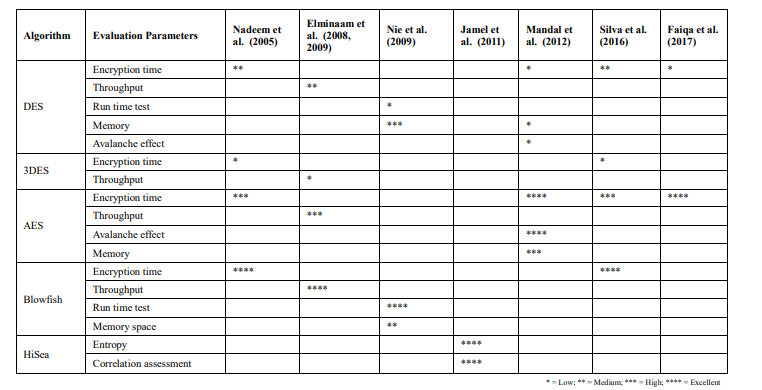

# Description

# Getting Started 🚀

### Prerequisites for running the Notebooks for the simulations

* <a href=https://www.python.org/downloads/release/python-370/> Python 3.7 or Greater</a>
* <a href=https://pip.pypa.io/en/stable/installation/> pip 21.3.1 or Greater</a>

After installing the requirements, run the following commands in order

```bash
# creates python virtual environment for the project
python -m venv ./venv 

# activates virtual environment; this is on Mac or Linux
source ./venv/bin/activate 

# This is for windows (Using Powershell)
.\venv\Scripts\activate.bat 

# upgrade pip to get the latest packages
python -m pip install --upgrade pip 

#Is used to check if the virtual environment is being used 
pip -V  

# Install all required dependencies
pip install -r requirements.txt 
```

### Cyclomatic Complexity

The cyclomatic complexity of the code can be tested using the following commands

``` bash
radon cc -a src 
```

## Using Password Strength to set password policy

This gives an easy method to set password policies for python projects (Password-strength. PyPI. (n.d.)).
Also, the entropy for the password policies can be set easily to achieve a stronger password.

``` python
from password_strength import PasswordPolicy

policy = PasswordPolicy.from_names(
    length=8,  # min length: 8
    uppercase=2,  # need min. 2 uppercase letters
    numbers=2,  # need min. 2 digits
    special=2,  # need min. 2 special characters
    nonletters=2,  # need min. 2 non-letter characters (digits, specials, anything)
)
policy.test('12345!')
```

### Commands for the applicaiton

``` bash
# Add-new-role
python src/main.py add-new-user-and-role --username-admin <CHANGE_USER> --password-admin <CHANGE_PASSWORD> --new-username <CHANGE_USER>--new-user-password <CHANGE_PASSWORD> --role NORMAL_USER

# Login
python src/main.py login --username <CHANGE_USER> --password <CHANGE_PASSWORD> 

# Add Music Data
python src/main.py add-music-data --username <CHANGE_USER> --password <CHANGE_PASSWORD>  --music-file-path audio_file_test.mp3 --music-score 1 --lyrics-file-path test.txt  

# list with token
 python src/main.py list-music-data  

 #list without token
 python src/main.py list-music-data --username <CHANGE_USER> --password <CHANGE_PASSWORD>

# Update music data
python src/main.py update-music-data --username <CHANGE_USER> --password <CHANGE_PASSWORD> --music-file-path tests/files/audio_file_test.mp3 --music-data-id <CHANGE_MUSIC_DATA_ID>

# Update music data without music file
python src/main.py update-music-data --username <CHANGE_USER> --password <CHANGE_PASSWORD>  --music-data-id <CHANGE_MUSIC_DATA_ID> --lyrics-file-path tests/files/test.txt  --music-score 2132 

# Delete music as normal user
python src/main.py delete-music-data --username <CHANGE_USER> --password <CHANGE_PASSWORD> --music-data-id <CHANGE_MUSIC_DATA_ID>

# Download data as an admin
python src/main.py download-music-data --username <CHANGE_USER> --password <CHANGE_USER> --music-data-id <CHANGE_MUSIC_DATA_ID>
```

### Run tests with coverage

To prove the

```bash
coverage run --source=src -m pytest -v tests && coverage report -m 

# Generate result in 
coverage html && open htmlcov/index.html  
```

### Types of roles in the Project

Currently, there are only two types of roles in this application but can the roles can be extended
by modification of some code.

| Role id | Role Name   | Description                                              |
|---------|-------------|----------------------------------------------------------|
| 1       | ADMIN       | Is allowed to do all the actions                         |
| 2       | NORMAL_USER | Is only allowed to view/change items created by the user |

### JWT Tokens

The Jwt token store user claims like user id, expiry date, permissions (Jones, M., Bradley, J. and Sakimura, N., 2015).
This token is stored in a config when the users successfully logs-in. The token in this
application is only used for read actions, as this would give the user a better user experience
by not making them log-in multiple times to read data. However, for sensitive actions such as delete, modify, and add a
re-authentication is required and the token is not used.

#### JWT Signature Algorithm

To prevent tampering of data an asymmetric digital signature EdDSA using Ed25519 algorithm because of the following
reasons:

* This algorithm is lightweight and performant due to its small key sizes (64 or 114 bytes) and signatures (Josefsson,
  S. and Liusvaara, I., 2017).
* The algorithm is collision resilient.
* It provides protection against different kinds of attacks like side-channel analysis, differential power analysis
  attacks(Bisheh-Niasar, M et.al, 2021)

### Data Encryption

To ensure data confidentiality in the project, the data has to be encrypted using a cryptographic algorithm. As
the cryptographic algorithm, the symmetric key algorithm AES-256 is applied to encrypt the sensitive data.

This
algorithm is chosen for the following reasons:

* AES-256 provides a good mixture of performance for memory, integrity and confidentiality (
  Mushtaq, M.F. et al. 2017).
* A good level of avalanche effect, making small changes in the data will not change the encrypted text making it less
  predictable to break.
* Memory performance is essential for this application as binary data, such as audio files and lyrics, will also be
  encrypted, which is more memory intensive than small texts.
* AES-256 can resist quantum computing attacks based on shor's algorithm (Rao, S., Mahto et al. 201).
  
  Encryption Algorithm comparison (Mushtaq, M.F. et al. 2017)

### Data Integrity

The project handles the upload of various music data, such as audio and lyric files, which has to ensure that no
tampering within the database is
carried out. A checksum is calculated using the SHA-256 hash function(Rachmawati.D et al., 2018)to ensure that the data
inside the database are not tampered with for spoofing attacks.

### References

* Bisheh-Niasar, M., Azarderakhsh, R. and Mozaffari-Kermani, M., 2021. Cryptographic accelerators for digital signature
  based on Ed25519. IEEE Transactions on Very Large Scale Integration (VLSI) Systems, 29(7), pp.1297-1305.
* Jones, M., Bradley, J. and Sakimura, N., 2015. Json web token (jwt) (No. rfc7519).
* Josefsson, S. and Liusvaara, I., 2017. Edwards-curve digital signature algorithm (EdDSA) (No. rfc8032).
* Mushtaq, M.F., Jamel, S., Disina, A.H., Pindar, Z.A., Shakir, N.S.A. and Deris, M.M., 2017. A survey on the
  cryptographic encryption algorithms. International Journal of Advanced Computer Science and Applications, 8(11).
* Password-strength. PyPI. (n.d.). https://pypi.org/project/password-strength/
* Rachmawati, D., Tarigan, J.T. and Ginting, A.B.C., 2018, March. A comparative study of Message Digest 5 (MD5) and
  SHA256 algorithm. In Journal of Physics: Conference Series (Vol. 978, p. 012116). IOP Publishing.
* Rao, S., Mahto, D., Yadav, D.K. and Khan, D.A., 2017. The AES-256 cryptosystem resists quantum attacks. Int. J. Adv.
  Res. Comput. Sci, 8(3), pp.404-408.
